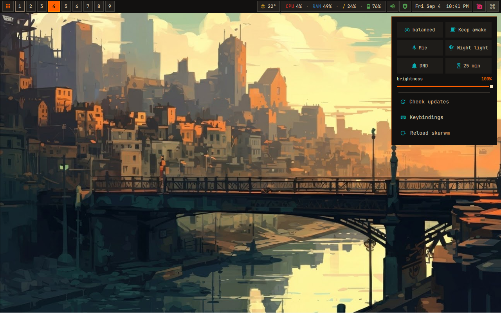

# skarwm

<div align="center">
<a href="https://github.com/nerdyslacker/skarwm"></a>
</div>

skarwm is a small keyboard-driven X11 window manager written in Odin. Windows
live in vertical columns on a horizontally scrolling strip; workspaces provide
the vertical dimension. The WM deliberately leaves bars, launchers,
notifications, and compositing to external programs.

Implemented features include dynamic workspaces, two-columns-per-view layout,
viewport scrolling, stacked and tabbed columns, RandR multi-monitor support,
independent workspaces per monitor, cross-monitor window movement,
floating/fullscreen windows, native scratchpads, atomic rc reloads, window rules, EWMH/ICCCM
interoperability, dock struts, and a nonblocking Unix-socket IPC interface.

> **Note:** skarwm was developed with the assistance of AI as a project for
> learning Odin. Although it remains a hobby project, it is already my daily
> driver.

## Dependencies

Building requires:

- Odin (the project is currently tested with Odin 2026.07 or newer);
- libxcb and its RandR extension runtime/development files;
- GNU Make and a normal C toolchain/linker.

Odin is available for Void through the Lazy Linux repository. Add the
repository once, refresh its index, and install the build dependencies:

```sh
printf '%s\n' 'repository=https://github.com/lazylinuxos/lazy-repo/releases/latest/download' \
  | sudo tee /etc/xbps.d/99-repository-lazy.conf
sudo xbps-install -S
sudo xbps-install -S odin libxcb-devel make gcc
```

Running skarwm requires an X11 server, `libxcb`, and at least one terminal or
launcher configured in `config.rc`. The default terminal command is selected
from `$TERMINAL`, falling back to `xterm`.

The complete integration test additionally requires Xvnc, xterm, xdotool,
xwininfo, xrandr, xprop, python-xlib, and optionally wmctrl for extra EWMH
message checks:

```sh
sudo xbps-install -S tigervnc xterm xdotool xwininfo xrandr xprop python3-xlib wmctrl
```

Interactive nested testing additionally requires Xephyr:

```sh
sudo xbps-install -S xorg-server-xephyr
```

Quickshell and the rest of the desktop integration are optional. The full
configuration under `extra/` uses:

- Quickshell and a JetBrainsMono Nerd Font for the bar;
- Picom for compositing and Dunst for notifications;
- native searchable Quickshell application and weather-settings popups, plus
  Feh for wallpaper handling;
- `setxkbmap` and `xkb-switch` for the keyboard-layout indicator, picker, and
  configuration popup;
- Clipmenu (`clipmenud`, `clipmenu`, and `clipdel`) for text clipboard history,
  plus Xdotool for popup placement and pasting;
- Kitty as the configured terminal;
- renCal for the full calendar interface and Python 3 for loading its local
  events into the calendar popup;
- `lxqt-policykit-agent` for graphical privilege prompts;
- `xss-lock` and Betterlockscreen for screen locking;
- Udiskie for removable-drive automounting and its tray item.

The bar and its companion network panel can additionally use NetworkManager
tools, BlueZ's `bluetoothctl`, `pactl`, `pavucontrol`, `curl`, `xdg-open`,
`flameshot`, `brightnessctl`, `powerprofilesctl`, `redshift`, `xset`,
`notify-send`, `xterm`, and the Void `xbps-install` tool. On Quickshell 0.3.0,
`xinput` and `xdotool` provide the bar popup outside-click fallback. Missing
optional tools only disable their corresponding widget action.

renCal is available from the same Lazy Linux repository. The calendar widget
continues to work without it, but omits its event list and keeps right-click
equivalent to the normal clock click.

On Void, install the available packages with XBPS; Betterlockscreen and a Nerd
Font may need to be installed separately depending on the enabled repositories:

```sh
sudo xbps-install -S quickshell picom dunst feh kitty xss-lock \
  betterlockscreen udiskie lxqt-policykit NetworkManager bluez pavucontrol \
  curl flameshot brightnessctl python3 renCal xterm xinput xdotool clipmenu \
  xkb-switch setxkbmap
```

## Build

```sh
make
make debug
make test
sudo make install
```

`make` produces `build/skarwm` and `build/skarwm-msg`; `make debug` produces
`build/skarwm-debug`. Copy
`config/example.rc` to `~/.config/skarwm/config.rc`, or pass another file with
`skarwm -c FILE`.

## Testing with Xephyr

Run skarwm in a nested X server without replacing the current desktop session:

```sh
make xephyr
```

This builds skarwm, opens a 1280×800 Xephyr window on display `:2`, and runs
skarwm with `extra/config.rc` inside it. `SKARWM_EXTRA_DIR` points at the
checkout's `extra/` tree, while writable state—including the isolated clipmenu
store—uses a temporary directory. Click inside the nested display and use the
full desktop bindings; for example, `Super+V` opens clipboard history. Close
the Xephyr window or press Ctrl-C in the launching terminal to stop both
processes.

For multi-monitor testing:

```sh
make xephyr-multi
```

The multi-monitor target partitions the nested display into two 640×800 RandR
1.5 monitor objects named `LEFT` and `RIGHT`. Use `Super+,` / `Super+.` to
change the focused monitor and `Super+Shift+,` / `Super+Shift+.` to move a
window between them. This uses the same monitor discovery path as real RandR
hardware. From another terminal, simulate unplugging and reconnecting the
right-hand monitor while skarwm is running:

```sh
DISPLAY=:2 xrandr --delmonitor RIGHT
DISPLAY=:2 xrandr --setmonitor RIGHT 640/170x800/210+640+0 none
```

That also makes it possible to observe output hotplug events with
`skarwm-msg subscribe output`; use the nested IPC socket printed by the
launcher rather than the socket of your normal session.

If display `:2` is already occupied, select another one:

```sh
make xephyr XEPHYR_DISPLAY=:3
```

To override the default config or pass other skarwm arguments directly, invoke
the launcher itself:

```sh
scripts/xephyr.sh single -c config/example.rc
```

Xephyr is intended for interactive smoke testing. `make test` remains the
automated unit and private-Xvnc integration suite.

For a staged package build, use the conventional variables:

```sh
make DESTDIR=/tmp/skarwm-package PREFIX=/usr install
```

This installs only the WM, message client, example configuration, session
launcher, and display-manager X session entry. It intentionally does not
install Quickshell or any other desktop extras.

## Full desktop configuration

After the minimal system install, install the complete per-user configuration
without `sudo`:

```sh
make install-extra
```

`make extra` is a shorter alias. This copies `extra/config.rc` and the Srcery
Quickshell bar and network panel, Picom, Dunst, Kitty, Polybar, Rofi, wallpaper,
weather, helper scripts, and bar configuration into `~/.config/skarwm`.
Existing files with the same names are replaced, so back up a customized
configuration first. An alternative target directory can be selected with
`SKARWM_CONFIG_DIR=/path`.

Packaged desktop files can instead be used directly without copying them into
the home directory. `skarwm-session` automatically selects
`/usr/share/skarwm/extra` when it exists. The same behavior can be configured
explicitly:

```sh
export SKARWM_CONFIG=/usr/share/skarwm/extra/config.rc
export SKARWM_EXTRA_DIR=/usr/share/skarwm/extra
export SKARWM_STATE_DIR="${XDG_STATE_HOME:-$HOME/.local/state}/skarwm"
exec skarwm-session
```

`SKARWM_CONFIG` selects the WM rc file, `SKARWM_EXTRA_DIR` is the root used by
the bundled autostarts, QML, and helper scripts, and `SKARWM_STATE_DIR` holds
writable bar settings such as weather, Pomodoro, and keyboard-layout state. The
state directory defaults to the extra directory for a per-user install and to
the XDG state directory when the extras come from `/usr/share`.

The keyboard module imports the layouts already configured in XKB. Left-click
it to select a layout; right-click it to search XKB's installed language
catalogue, choose layouts, set aligned variants, and select the group-switch
shortcut. Those choices are reapplied when the bar starts.

`clipmenud` records up to 100 text clipboard entries in a skarwm-specific
store. It is launched with `CM_SELECTIONS=clipboard`, so highlighting text
through X11's PRIMARY selection does not add popup history; an explicit copy
does. The private store also prevents another default `clipmenud` user service
from mixing PRIMARY entries into this popup. Click the clipboard bar icon to
open history beneath the bar, or use `Super+V` to open the same searchable
popup beside the pointer. Click an entry—or select it with the arrow keys and
Enter—to paste it into the window that was focused before the popup opened.
Clear removes the stored history. Images and pinned entries are not supported
by this clipmenu-backed popup.

The full rc starts:

- `lxqt-policykit-agent`;
- the bundled default wallpaper through Feh;
- Dunst, Picom, and Quickshell with the installed configurations;
- `clipmenud`, restricted to the CLIPBOARD selection;
- `xss-lock`, which invokes Betterlockscreen;
- Udiskie with its smart tray integration.

Initialize Betterlockscreen's cache once before relying on automatic locking:

```sh
betterlockscreen -u ~/.config/skarwm/wallpaper/default.jpeg
```

Then start skarwm normally from a display manager or `startx`.

<div align="center">
<a href="https://github.com/nerdyslacker/skarwm"></a>
</div>

## First run with startx

```sh
mkdir -p ~/.config/skarwm
cp config/example.rc ~/.config/skarwm/config.rc
cp extra/xinitrc.example ~/.xinitrc
startx
```

Alternatively, add `exec skarwm` to an existing `~/.xinitrc`. After
`sudo make install`, display managers that read `/usr/local/share/xsessions`
should offer “skarwm”; distributions that only scan `/usr/share/xsessions`
should install with `PREFIX=/usr`.

The minimal example does not start a bar or compositor implicitly. Add explicit
rc entries when wanted, for example:

```text
autostart : "qs -p ~/.config/skarwm/quickshell"
autostart : "picom"
```

The ready-to-use [`extra/config.rc`](extra/config.rc) already contains the full
session autostart set described above.

Logging defaults to `INFO`. Set `SKARWM_LOG=debug`, `info`, `warn`, `error`, or
`off` before starting the session to select the minimum diagnostic level.

## Configuration

The search order is `skarwm -c FILE`, `$SKARWM_CONFIG`,
`$XDG_CONFIG_HOME/skarwm/config.rc`, then `~/.config/skarwm/config.rc`. Reload
is atomic: a malformed replacement is reported and the previous configuration
stays active. The fully commented [`config/example.rc`](config/example.rc)
documents settings, key actions, workspace bindings, rules, and autostart.

Default interaction highlights:

- `Super+h/j/k/l`: focus left/down/up/right;
- `Super+Shift+h/j/k/l`: move within/between columns;
- `Super+1` … `Super+9`: switch workspace;
- `Super+Shift+1` … `Super+Shift+9`: send the focused window;
- `Super+n/p`: next/previous workspace;
- `Super+Control+n/p`: send to the next/previous workspace;
- `Super+Space`: toggle floating;
- `Super+t`: make the focused column tabbed, or split its tabs back into
  horizontal columns;
- `Super+/`: show or hide an overlay containing every currently configured
  skarwm keybinding;
- `Super+grave`: assign/toggle scratchpad register 1;
- `Super+Shift+grave`: assign/toggle floating scratchpad register 2;
- `Super+Control+grave`: remove scratchpad register 1;
- `Super+Shift+Return`: run the `Super+Return` command as a new tab when a
  tabbed column is focused;
- `Super`+wheel up/down: scroll the window strip left/right by one column;
- `Super+,/.`: focus the previous/next monitor;
- `Super+Shift+,/.`: send the focused window to the previous/next monitor;
- click: focus; `Super`+left-drag moves a floating window or drops a tiled
  window into another column; both operations work across monitors;
  `Super`+right-drag resizes a floating window.

While a tiled window is dragged, exactly four outlined choices appear on each
monitor, regardless of its window count. Top and bottom insert the window at
that end of the monitor's focused column. Left and right create a horizontal
column at the corresponding workspace edge. The zones fill the work area: a
full-width top band, a middle row split left/right, and a full-width bottom
band. On an empty monitor, any choice creates its first column.

Tabbed mode applies only to the focused column, so the rest of the workspace
continues tiling normally. Choose the members by moving windows into that
column with `Super+Shift+h/l`, then use `Super+k/j` to select tabs and
`Super+Shift+k/j` to reorder tabs. The active tab occupies the entire column;
the other tabs remain managed but hidden. A title strip shows and highlights
the tabs, and tabs can also be selected by clicking them. `skarwm-msg
get-windows` exposes tab metadata for other UI clients.

For example, focus a window and press `Super+Shift+h` to move it into the
column on its left, then press `Super+t`. Only those windows sharing that
column become tabs; neighboring columns stay tiled. Move another window into
the tabbed column to add it to the same group. Press `Super+t` again to split
that group back into individual horizontal columns. The explicit IPC/config
action `layout_stacked` remains available when a vertical stack is desired.

This Shift behavior is generated for every `bind` command. For example, if
`Super+b` launches a browser, `Super+Shift+b` launches the same command into
the focused tab group without requiring another rc entry. Outside tabbed mode
the generated Shift variant launches a normal tiled window. If the rc file
defines the shifted combination explicitly, that explicit binding takes
precedence. The placement request expires after ten seconds and applies only
to the next top-level window, so a failed launcher cannot capture unrelated
windows indefinitely.

### Scratchpads

skarwm has native, session-only scratchpad registers. No helper daemon or
visible `stash` workspace is needed: hidden windows stay managed but are
removed from the tiled layout and parked off-screen. A first toggle assigns the
focused window; later toggles hide it or summon it onto the currently focused
workspace and monitor:

```text
call : mod + grave : scratchpad_toggle 1
call : mod + Shift + grave : scratchpad_toggle_float 2
call : mod + Control + grave : scratchpad_remove 1
```

The example configurations include those bindings. Registers disappear when
skarwm exits, and closing a registered application clears its registrations.
The IPC also supports exact-match static groups by X11 app ID (`WM_CLASS`),
class, instance, or title:

```sh
skarwm-msg scratchpad target appid kitty
skarwm-msg scratchpad target title "Music Player"
skarwm-msg scratchpad target-float class Pavucontrol
skarwm-msg scratchpad target appid kitty --spawn kitty
```

When any matching window is hidden, a target command summons all matches;
otherwise it hides all matches. An optional `--spawn COMMAND` starts the app
when no window matches. `get-windows` exposes `scratchpad` and
`scratchpad_register` state. See [docs/IPC.md](docs/IPC.md) for the full command
reference.

RandR 1.5 monitor objects are discovered at startup and rescanned after screen,
CRTC, output, and resource changes. Each monitor keeps its own current
workspace and viewport position. New windows open on the monitor containing
the pointer, and `Super`+wheel scrolls only the monitor under the pointer.
Monitor focus and movement wrap in RandR discovery order. If a monitor
disappears, its workspaces and windows migrate to a surviving monitor. Servers
without RandR 1.5 fall back to one screen-sized output.

All keyboard bindings can be replaced in the rc file. Mouse drag and wheel
scrolling use the configured `mod_key`; explicit `mousebind` directives remain
reserved for a future configurable mouse-action layer.

## IPC and shell integration

See [docs/IPC.md](docs/IPC.md) for commands, queries, events, and socket
selection. The full Quickshell bar and reusable `Wm.qml` adapter live in
`extra/quickshell`; see its README for launch and reuse instructions.

## Future features

- configurable `mousebind` declarations in the rc file, replacing the current
  fixed click-to-focus, `mod_key` drag, and `mod_key` wheel actions with
  user-defined bindings.

skarwm is not a compositor and does not aim for full i3 IPC compatibility.

## Inspiration

skarwm was inspired by:

- [tonybanters/oxwm](https://github.com/tonybanters/oxwm)
- [Mr-Emacs/nwm](https://github.com/Mr-Emacs/nwm)
- [drew/dwm-setup](https://justaguy.dev/drew/dwm-setup)
